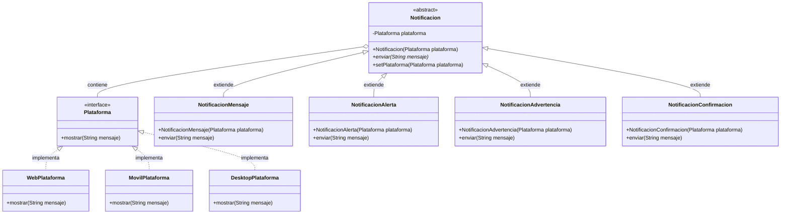

# Patrones de Diseño 

Aplicación del patrón Bridge para el sistema de notificaciones.


# 1. Tipo de patrón

   El patrón utilizado es Bridge, clasificado como un patrón estructural. Se usa para desacoplar una
   abstracción de su implementación, permitiendo que ambas evolucionen de forma independiente.


# 2. Problema inicial
   El sistema requiere múltiples tipos de notificación (mensaje, alerta, advertencia, confirmación) y
   múltiples plataformas (web, móvil, escritorio). Si se utiliza herencia directa, se produce una explosión combinatoria de clases.
  
   NotificacionMensajeWeb
   NotificacionMensajeMovil
   NotificacionMensajeDesktop
   NotificacionAlertaWeb
   
   Esto genera alto acoplamiento, difícil mantenimiento y poca escalabilidad.


# 3. Solución propuesta con patrón Estructural -- Bridge

   Se separan las responsabilidades en dos jerarquías:

1) Abstracción → Notificación (qué se envía)

2) Implementación → Plataforma (cómo se muestra)
   Ambas jerarquías se conectan por composición en lugar de herencia.

3) Cómo funcionan las clases entre sí

   Notificacion (abstract)
   ■■ contiene → Plataforma
   ■■ delega → plataforma.mostrar()


   Plataforma (interface)
   ■■ implementada por Web, Movil, Desktop

   Flujo de ejecución:

   Cliente → Notificacion.enviar()
   Notificacion → delega → Plataforma.mostrar()
   Plataforma → imprime en consola

# 5. Diagrama de clases



# 6. Digramas de secuencia


**6.1. Flujo completo del sistema con composición**
   
   En este diagrama se muestra la arquitectura completa del sistema, destacando cómo el patrón Bridge utiliza composición en lugar de herencia para conectar las dos jerarquías.
   

   
   ```mermaid

   sequenceDiagram
       actor Main
       participant Abstracción as <<Jerarquía Abstracción>>
       participant NM as NotificacionMensaje
       participant Implementación as <<Jerarquía Implementación>>
       participant WP as WebPlataforma
       
       Note over Main,WP: Fase de Creación: Inyección de Dependencias
       Main->>WP: new WebPlataforma()
       activate WP
       WP-->>Main: webPlataforma
       deactivate WP
       
       Main->>NM: new NotificacionMensaje(webPlataforma)
       activate NM
       Note over NM: Composición: almacena referencia
       NM->>Implementación: plataforma = webPlataforma
       NM-->>Main: notificacion
       deactivate NM
       
       Note over Main,WP: Fase de Ejecución: Delegación a través del Bridge
       Main->>NM: enviar("Hola mundo")
       activate NM
       Note over NM,Abstracción: Notificacion::enviar()
       NM->>NM: formatear mensaje con prefijo
       
       Note over NM: Bridge: delegación a implementación
       NM->>WP: plataforma.mostrar("Mensaje: Hola mundo")
       activate WP
       Note over WP,Implementación: Plataforma::mostrar()
       WP->>WP: aplicar formato específico de plataforma
       WP->>WP: println("[WEB] Mensaje: Hola mundo")
       WP-->>NM: retorna
       deactivate WP
       
       NM-->>Main: operación completada
       deactivate NM
   ```
   

   **Explicación del flujo completo:**
   
   **Fase 1 - Creación:**
   1. Se instancia la implementación concreta (WebPlataforma)
   2. Se inyecta la plataforma en la abstracción (NotificacionMensaje)
   3. La notificación almacena la referencia mediante **composición**
   
   **Fase 2 - Ejecución:**
   1. El cliente llama al método de la abstracción (`enviar()`)
   2. La abstracción procesa el mensaje según su lógica (agrega "Mensaje: ")
   3. **Bridge:** La abstracción delega a la implementación mediante la interfaz
   4. La implementación ejecuta su lógica específica (agrega "[WEB] ")
   5. El resultado se propaga de vuelta al cliente
   

   **Operación del patrón - Principios clave:**

   - **Composición sobre herencia:** `Notificacion` contiene una `Plataforma`, no hereda de ella
   - **Programación a interfaces:** `Notificacion` depende de la interfaz `Plataforma`, no de
     implementaciones concretas
   - **Inversión de dependencias:** Las clases concretas dependen de abstracciones
   - **Separación de responsabilidades:** Cada jerarquía tiene una razón para cambiar diferente
   - **Principio Open/Closed:** Extensible (nuevas notificaciones/plataformas) sin modificar código existente


---
**6.2. Flujo básico de envío de notificación**

Este diagrama muestra el flujo fundamental del patrón Bridge: cómo una notificación específica(NotificacionMensaje) delega la presentación a una plataforma específica (WebPlataforma).


   
   ```mermaid
   sequenceDiagram
       actor Cliente
       participant NM as NotificacionMensaje
       participant P as Plataforma
       participant WP as WebPlataforma
       
       Cliente->>NM: new NotificacionMensaje(webPlataforma)
       activate NM
       NM->>P: plataforma = webPlataforma
       deactivate NM
       
       Cliente->>NM: enviar("Hola mundo")
       activate NM
       Note over NM: Agrega prefijo "Mensaje: "
       NM->>WP: mostrar("Mensaje: Hola mundo")
       activate WP
       WP->>WP: System.out.println("[WEB] Mensaje: Hola mundo")
       WP-->>NM: void
       deactivate WP
       NM-->>Cliente: void
       deactivate NM
   ```
   
   **Explicación del flujo:**
   1. El cliente crea una instancia de `NotificacionMensaje` pasándole la plataforma web
   2. El cliente invoca `enviar()` con el mensaje
   3. `NotificacionMensaje` agrega su formato específico ("Mensaje: ") al texto
   4. Delega a la plataforma mediante `plataforma.mostrar()`
   5. `WebPlataforma` agrega su propio formato ("[WEB] ") y muestra en consola
   
   **Operación del patrón:** La abstracción (NotificacionMensaje) no conoce los detalles de
   implementación de la plataforma, solo usa su interfaz. Esto permite cambiar la plataforma
   sin modificar la notificación.

   ---

   **6.3. Cambio dinámico de plataforma en tiempo de ejecución**
   
   Este diagrama demuestra una de las ventajas clave del patrón Bridge: la capacidad de cambiar
   la implementación (plataforma) de una abstracción (notificación) durante la ejecución del programa.
   
   ```mermaid
   sequenceDiagram
       actor Cliente
       participant N as notificacion:NotificacionMensaje
       participant WP as webPlataforma:WebPlataforma
       participant MP as movilPlataforma:MovilPlataforma
       
       Note over Cliente,MP: Configuración inicial con plataforma Web
       Cliente->>N: new NotificacionMensaje(webPlataforma)
       
       Cliente->>N: enviar("Primera notificación")
       activate N
       N->>WP: mostrar("Mensaje: Primera notificación")
       activate WP
       WP->>WP: println("[WEB] Mensaje: Primera notificación")
       deactivate WP
       deactivate N
       
       Note over Cliente,MP: Cambio de plataforma sin crear nueva instancia
       Cliente->>N: setPlataforma(movilPlataforma)
       activate N
       N->>N: plataforma = movilPlataforma
       deactivate N
       
       Cliente->>N: enviar("Ahora en móvil")
       activate N
       N->>MP: mostrar("Mensaje: Ahora en móvil")
       activate MP
       MP->>MP: println("[MOVIL] Mensaje: Ahora en móvil")
       deactivate MP
       deactivate N
   ```
   
   **Explicación del flujo:**
   1. Se crea una notificación con plataforma web inicial
   2. Se envía un primer mensaje que aparece en formato web
   3. Se cambia la plataforma a móvil usando `setPlataforma()`
   4. El mismo objeto notificación ahora muestra mensajes en formato móvil
   
   **Operación del patrón:** El objeto `Notificacion` mantiene una referencia a `Plataforma` que
   puede ser reemplazada. Esto permite adaptar el comportamiento sin crear nuevas instancias,
   demostrando la flexibilidad del patrón Bridge.

   ---

   **6.4. Múltiples tipos de notificación con diferentes plataformas**
   
   Este diagrama ilustra cómo el patrón Bridge permite combinar libremente diferentes tipos de notificaciones con diferentes plataformas, evitando la explosión combinatoria de clases.
   
   ```mermaid
   sequenceDiagram
       actor Cliente
       participant NM as NotificacionMensaje
       participant NA as NotificacionAlerta
       participant NAd as NotificacionAdvertencia
       participant WP as WebPlataforma
       participant MP as MovilPlataforma
       participant DP as DesktopPlataforma
       
       Note over Cliente,DP: Mismo cliente, diferentes combinaciones
       
       Cliente->>NM: new NotificacionMensaje(webPlataforma)
       Cliente->>NM: enviar("Bienvenido")
       NM->>WP: mostrar("Mensaje: Bienvenido")
       WP-->>NM: [WEB] Mensaje: Bienvenido
       
       Cliente->>NA: new NotificacionAlerta(movilPlataforma)
       Cliente->>NA: enviar("Batería baja")
       NA->>MP: mostrar("🚨 ALERTA: Batería baja")
       MP-->>NA: [MOVIL] 🚨 ALERTA: Batería baja
       
       Cliente->>NAd: new NotificacionAdvertencia(desktopPlataforma)
       Cliente->>NAd: enviar("Espacio casi lleno")
       NAd->>DP: mostrar("⚠ ADVERTENCIA: Espacio casi lleno")
       DP-->>NAd: [DESKTOP] ⚠ ADVERTENCIA: Espacio casi lleno
   ```
   
   **Explicación del flujo:**
   1. Tres tipos diferentes de notificaciones se combinan con tres plataformas distintas
   2. Cada tipo de notificación aplica su formato específico (Mensaje, 🚨 ALERTA, ⚠ ADVERTENCIA)
   3. Cada plataforma aplica su prefijo específico ([WEB], [MOVIL], [DESKTOP])
   4. Las combinaciones son independientes y extensibles
   
   **Operación del patrón:** Con 4 tipos de notificaciones y 3 plataformas, solo necesitamos
   7 clases (4 + 3) en lugar de 12 clases (4 × 3) que requeriría herencia directa. El patrón
   Bridge separa las dos dimensiones de variación:
   - **Dimensión 1:** Tipo de notificación (qué se envía)
   - **Dimensión 2:** Plataforma (cómo se muestra)
   
   Ambas dimensiones evolucionan independientemente sin afectarse mutuamente.

   
  

# 7. Beneficios obtenidos

   ✔ Separación de responsabilidades.

   ✔ Menor número de clases (n + m).

   ✔ Extensible sin modificar código existente (OCP).

   ✔ Cambio de plataforma en tiempo de ejecución.

   ✔ Mayor mantenibilidad y pruebas más simples.


# 8. Conclusión

   El patrón Bridge permite desacoplar la lógica del mensaje del medio de presentación, resolviendo la explosión combinatoria de clases y haciendo el sistema más flexible, escalable y mantenible. Es la solución más adecuada cuando existen múltiples dimensiones que cambian de forma independiente.